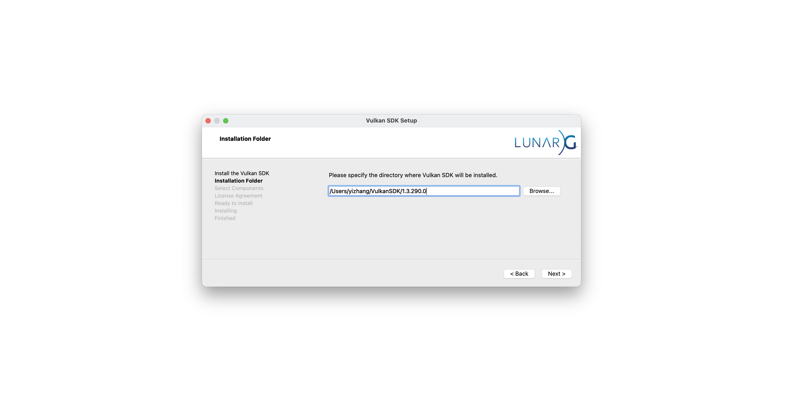
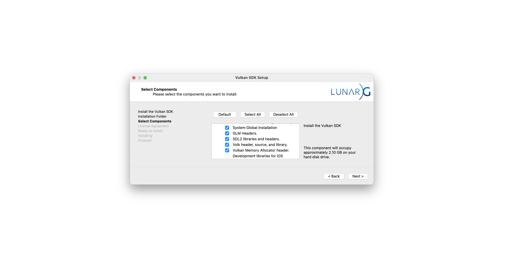

# SAPIEN Nightly

[![GitHub][github_badge]][github_link] [![PyPI][pypi_badge]][pypi_link]

SAPIEN Nightly helps you install [SAPIEN Nightly Release](https://github.com/haosulab/SAPIEN/releases/tag/nightly) with ease!


## Prerequisites

### Operating Systems

Only macOS is supported.


### Python Versions

Python 3.10 or higher are required.


### Vulkan SDK Installation

* Download the Vulkan SDK installer from the [link](https://sdk.lunarg.com/sdk/download/1.3.290.0/mac/vulkansdk-macos-1.3.290.0.dmg).

* Open the downloaded `vulkansdk-macos-1.3.290.0.dmg` file, and specify the directory where Vulkan SDK will be installed. We recommend using the default path. If you customize the path, note it down as you'll need to set it as an environment variable later.

  

* Select the components you want to install. We recommend the following configuration for a minimal working installation. Development libraries for iOS are not necessary and take significant disk usage.

  

* Follow the remaining instructions to complete the installation.

* Add the following environment variables to your shell startup file `~/.zshrc` or `~/.bash_profile` to automatically load them when opening a new terminal session:

  ```bash
  # >>> SAPIEN Nightly Release initialize >>>
  export VULKAN_SDK=/path/to/VulkanSDK/1.3.290.0/macOS
  
  export PATH=$VULKAN_SDK/bin:$PATH
  export VK_ICD_FILENAMES=$VULKAN_SDK/share/vulkan/icd.d/MoltenVK_icd.json
  export VK_LAYER_PATH=$VULKAN_SDK/share/vulkan/explicit_layer.d
  export DYLD_LIBRARY_PATH=$VULKAN_SDK/lib:$DYLD_LIBRARY_PATH
  # <<< SAPIEN Nightly Release initialize <<<
  ```


## Installation

Install SAPIEN Nightly Release:

```bash
git clone git@github.com:imyizhang/SAPIEN-Nightly.git
pip install -e SAPIEN-Nightly
```

or

```bash
uv pip install -e SAPIEN-Nightly
```


## Quickstart

You may test the onscreen rendering of SAPIEN with:

```bash
python -m sapien.example.hello_world
```

This will open a GUI viewer window displaying a red cube on a plane. If you can see and interact with this GUI, your installation is working correctly.


## License

SAPIEN Nightly has a MIT license, as found in the [LICENSE](https://github.com/imyizhang/SAPIEN-Nightly/blob/main/LICENSE) file.


## Contributing

Thanks for your interest in contributing to SAPIEN Nightly! Please feel free to create a pull request.


## Changelog

**SAPIEN Nightly 0.0.1**

* First release


[github_badge]: https://badgen.net/badge/icon/GitHub?icon=github&color=black&label
[github_link]: https://github.com/imyizhang/SAPIEN-Nightly


[pypi_badge]: https://badgen.net/pypi/v/sapien-nightly?icon=pypi&color=black&label
[pypi_link]: https://www.pypi.org/project/sapien-nightly